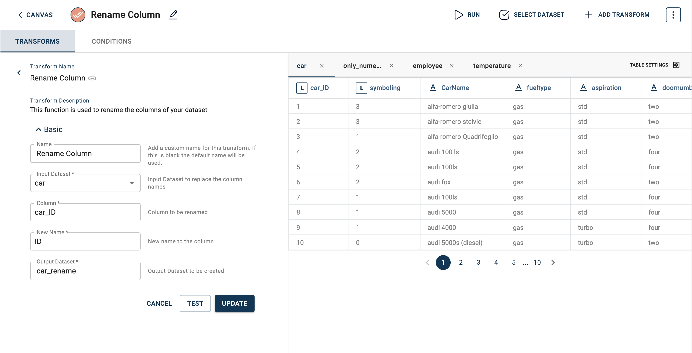

*Rename Column*
=============================

This function is used to rename the columns of your dataset

*tags:* ["Data Preparation"]

**Parameters**
-----

- **Input Dataset:** Input Dataset to replace the column names(*Required:* TRUE, *Multiple:* FALSE)
  
|
- **Column:** Column to be renamed (*Required:* TRUE, *Multiple:* FALSE, *Datatypes:* ['ANY'], *Options:* FIELDS, *Datasets:* Input Dataset)
  
|
- **New Name:** New name to the column
  
  - Required: TRUE
  - Multiple: FALSE
  - Datatypes: ['STRING']
  - Options: CONSTANT

|
- **Output Dataset:** Output Dataset to be created

  - Required: TRUE
  - Multiple: FALSE
  

**Requirements**
-----
pandas

**How to use it in Notebook**
-----

```
template=TemplateV2.get_template_by('Rename Column')
recipe_Rename_Column= project.addRecipe([car_data, employee_data, temperature_data, only_numeric], name='Rename Column')
transform=Transform()
transform.templateId = template.id
transform.name='Rename Column'
transform.variables = { 
'input_dataset':'car',
'column':"car_ID",
'new_column_name':"ID",
'output_dataset':'car_rename'}
recipe_Rename_Column.add_transform(transform)
recipe_Rename_Column.run()
```

**How to use it in RC UI**
-----



